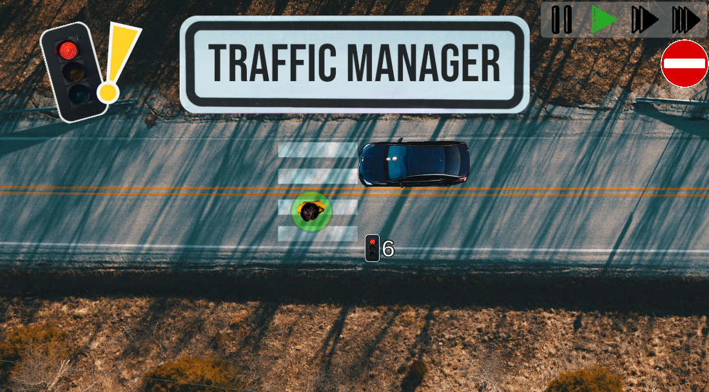

# 

# Traffic Manager

A game to train my skills with Unity. It combines the control of time, simulation and puzzle.

## Table of contents

- [About the game](#about-the-game)
- [Roadmap](#roadmap)
- [Used Assets](#used-assets)
- [Used Tools](#used-tools)
- [Contributing](#contributing)

## About the game

Your job will be to manage the traffic lights in order to optimize the traffic across different levels.

 The goal is to avoid any road user to stop by interacting with each traffic light color duration.

If you manage to configure them so no road user must stop for the time specified upper right, then you'd solved the level!

## Roadmap

- [ ] Develop more levels
- [ ] Extend tutorial
- [ ] Expand unit testing
- [ ] Fix minor bugs

## Used Assets

### Background images

- Photo by [Denys Nevozhai](https://unsplash.com/@dnevozhai?utm_source=unsplash&utm_medium=referral&utm_content=creditCopyText) on [Unsplash](https://unsplash.com/es/s/fotos/street-topdown?utm_source=unsplash&utm_medium=referral&utm_content=creditCopyText) - End Scene Background
- Photo by [Ozark Drones](https://unsplash.com/@ozarkdrones?utm_source=unsplash&utm_medium=referral&utm_content=creditCopyText) on [Unsplash](https://unsplash.com/es/s/fotos/street-topdown?utm_source=unsplash&utm_medium=referral&utm_content=creditCopyText) - Tutorial and level Background
- Photo by [Andrea Cau](https://unsplash.com/@andreacau?utm_source=unsplash&utm_medium=referral&utm_content=creditCopyText) on [Unsplash](https://unsplash.com/s/photos/city?utm_source=unsplash&utm_medium=referral&utm_content=creditCopyText) - Levels Background
- Concrete background texture by [Rob Tuytel](https://www.artstation.com/tuytel) on [PolyHaven](https://polyhaven.com/a/concrete_floor_01) - Used in main menu

### Game elements

- Photo by [Brydon McCluskey](https://unsplash.com/@brydoncreative?utm_source=unsplash&utm_medium=referral&utm_content=creditCopyText) on [Unsplash](https://unsplash.com/es/s/fotos/topdown-car?utm_source=unsplash&utm_medium=referral&utm_content=creditCopyText") - Cars and Pedestrian
- Photo by [Pawel Tadejko](https://unsplash.com/@ptadejko?utm_source=unsplash&utm_medium=referral&utm_content=creditCopyText) on [Unsplash](https://unsplash.com/s/photos/topdown?utm_source=unsplash&utm_medium=referral&utm_content=creditCopyText) - Pedestrian
- Photo by [Dalton Touchberry](https://unsplash.com/@daltontouch?utm_source=unsplash&utm_medium=referral&utm_content=creditCopyText) on [Unsplash]("https://unsplash.com/s/photos/topdown-shoes?utm_source=unsplash&utm_medium=referral&utm_content=creditCopyText") - Pedestrian shoes

### UI elements

- Photo by [Behzad Ghaffarian](https://unsplash.com/es/@behz?utm_source=unsplash&utm_medium=referral&utm_content=creditCopyText) on [Unsplash]("https://unsplash.com/es/fotos/pipa-azul-1FkuY2PReLc") - Pedestrian's Traffic Light
- Symbol of [Under construction sign]("https://uxwing.com/under-construction-symbol-icon/") on [Uxwing](https://uxwing.com/) - Used in Settings' scene
- Head of police by [Craftpix_net](https://twitter.com/craftpix_net?utm_campaign=Website&utm_source=opengameart.org&utm_medium=public) on [OpenGameArt](https://opengameart.org/content/police-2d-sprite) - Used in tutorial UI
- Photo by [insung yoon](https://unsplash.com/@insungyoon?utm_source=unsplash&utm_medium=referral&utm_content=creditCopyText) on [Unsplash](https://unsplash.com/s/photos/clock?utm_source=unsplash&utm_medium=referral&utm_content=creditCopyText) - Clock reverting time effect
- Photo by [Eduardo Soares](https://unsplash.com/@eduschadesoares?utm_source=unsplash&utm_medium=referral&utm_content=creditCopyText)on [Unsplash]("https://unsplash.com/es/s/fotos/traffic-cone?utm_source=unsplash&utm_medium=referral&utm_content=creditCopyText") - Traffic cone used in Settings' scene
- Photo by [Raúl Nájera](https://unsplash.com/@reinf?utm_source=unsplash&utm_medium=referral&utm_content=creditCopyText) on [Unsplash](https://unsplash.com/es/s/fotos/road-work?utm_source=unsplash&utm_medium=referral&utm_content=creditCopyText") - Generic sign
- Photo by [Jon Tyson](https://unsplash.com/@jontyson?utm_source=unsplash&utm_medium=referral&utm_content=creditCopyText) on [Unsplash]("https://unsplash.com/es/s/fotos/road-work?utm_source=unsplash&utm_medium=referral&utm_content=creditCopyText") - Settings diamond sign
- Photo by [Şeyma Sgz](https://unsplash.com/@seymasgz?utm_source=unsplash&utm_medium=referral&utm_content=creditCopyText) on [Unsplash]("https://unsplash.com/s/photos/traffic-sign?utm_source=unsplash&utm_medium=referral&utm_content=creditCopyText") - Quit sign and empty traffic sign
- Photo by [Markus Spiske](https://unsplash.com/@markusspiske?utm_source=unsplash&utm_medium=referral&utm_content=creditCopyText) on [Unsplash]("https://unsplash.com/es/s/fotos/road-work?utm_source=unsplash&utm_medium=referral&utm_content=creditCopyText") - Traffic Beacon used in Settings' menu

### Audios

- Music by [benpm](https://freesound.org/people/benpm) on [freesound](https://freesound.org/people/benpm/sounds/203099/) - Cars sound
- Audio by [guitarguy1985](https://freesound.org/people/guitarguy1985) on [freesound](https://freesound.org/people/guitarguy1985/sounds/70939/) - Police sound effect
- Audio by [deleted_user_3544904](https://freesound.org/people/deleted_user_3544904/) on [freesound](https://freesound.org/people/deleted_user_3544904/sounds/380435/) - Cars sound

### Font

- Bebas Neue on [Google Fonts](https://fonts.google.com/specimen/Bebas+Neue)

## Used Tools

- [Unity 2022.3](https://unity.com/en/download)
- [Gimp](https://www.gimp.org/)
- [Audacity](https://www.audacityteam.org/)
- [Inkscape](https://inkscape.org/y)

## Contributing

To get started contributing, make sure to read the [Contributing Guide](.github/CONTRIBUTING.md) before making a issue or a pull request. Also you can check the [Code of Conduct Guides](.github/CODE_OF_CONDUCT.md).